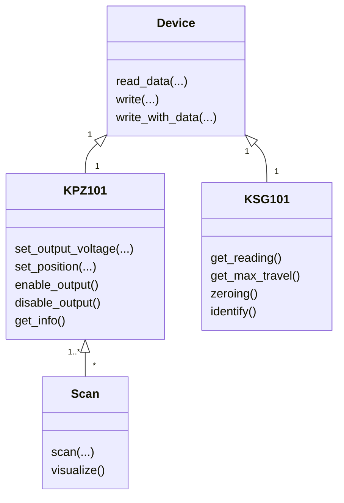

Documentation du module python

## Sommaire

- [[Installation]]
- [[Exemples]]
- [[KPZ101]]
- [[KSG101]]
- [[Scan]]
- [[Device]]
- [[Ajouter une fonctionnalité à un appareil préexistant]]
- [[Ajouter un appareil APT]]
- [[Ajouter un mouvement quelconque]]

## Démonstration avec un [[Thorlabs MAX311D|nanomax]]

#todo 
#### Montage

#### Déplacements de base

Les photos illustrent aussi le problème que j'ai eu pour faire marcher le KPZ en boucle fermé (voir [[Mail thorlabs]])

![[CelluleFEMTO_WMS5000010.jpg]]
![[CelluleFEMTO_WMS5000009.jpg]]
![[CelluleFEMTO_WMS5000008.jpg]]
#### Simulation

![[Figure_1.png]]

#### Balayage

## Place de ce module dans [[Microscopie Confocale]] 
#todo

## Liens supplémentaires
- [[APT]]
- [[kinesis]]
- [[Thorlabs MAX311D]]
- [[KCH601]]
