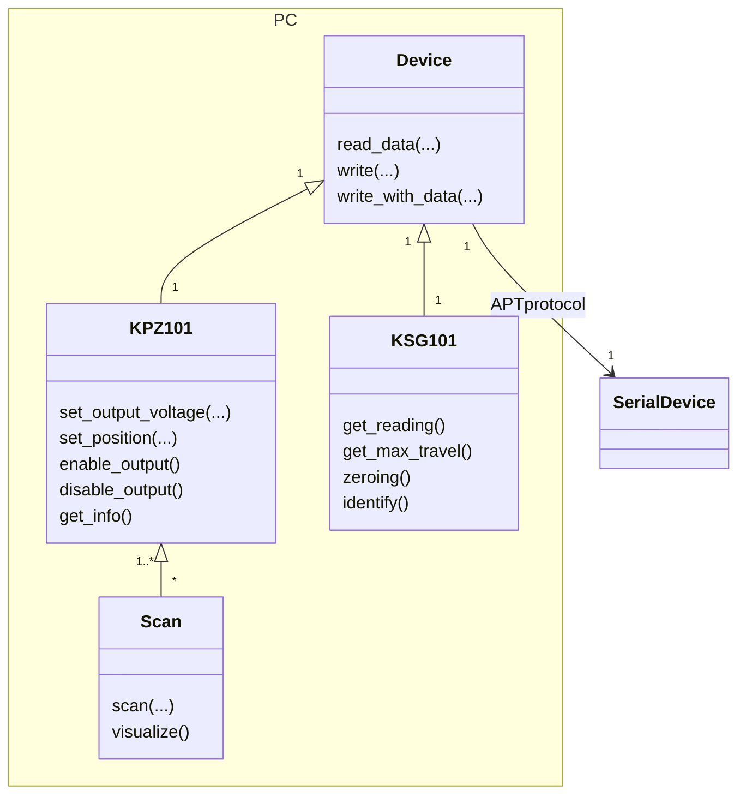

Documentation du module python

## Sommaire

- [[Installation]]
- [[Exemples]]
- API
	- [[KPZ101]]
	- [[KSG101]]
	- [[Scan]]
	- [[Device]]
- Extra
	- [[Ajouter une fonctionnalité à un appareil préexistant]]
	- [[Ajouter un appareil APT]]
	- [[Ajouter un mouvement quelconque]]
	- [[json schema]]

## Démonstration avec un [[Thorlabs MAX311D|nanomax]]

#### Montage

On peut voire les 3 [[KPZ101]] (ils fonctionnent en boucle fermée) et le [[Thorlabs MAX311D|nanomax]] sous un microscope. Les [[KPZ101]] sont posés sur un [[KCH601|hub]] relié en usb au PC.
![[20240215_151659.jpg|600]]

#### Déplacements de base

Les photos illustrent aussi le problème que j'ai eu pour faire marcher le KPZ en boucle fermé (voir [[Mail thorlabs]])

![[CelluleFEMTO_WMS5000010.jpg]]
![[CelluleFEMTO_WMS5000009.jpg]]
![[CelluleFEMTO_WMS5000008.jpg]]
#### Simulation

Avec la fonction `visualize()`

![[Figure_1.png]]

#### Scan 

Le diamètre du défaut sur le plateau que l'on voit ci-dessous est d'environ $10µm$

###### Serpentin
![[serpentin.gif]]

###### Spirale
![[spirale.gif]]

## Place de ce module dans la [[Microscopie Confocale]] 

Ce module python créer une couche d'abstraction par dessus les commandes bas niveaux envoyées aux gauges et aux contrôleurs. Le chercheurs pourront ainsi contrôler le déplacement d'un plateau à l'échelle nanométrique et faire une mesure entre chaque points à l'aide d'une seule commande : `scan(...)`. Le fait de pouvoir faire ceci en python va permettre aux chercheurs de créer des expériences complexes qui nécessite une synchronisation entre les différents équipements de laboratoire.

## Liens supplémentaires
- [[APT]]
- [[kinesis]]
- [[Thorlabs MAX311D]]
- [[KCH601]]
